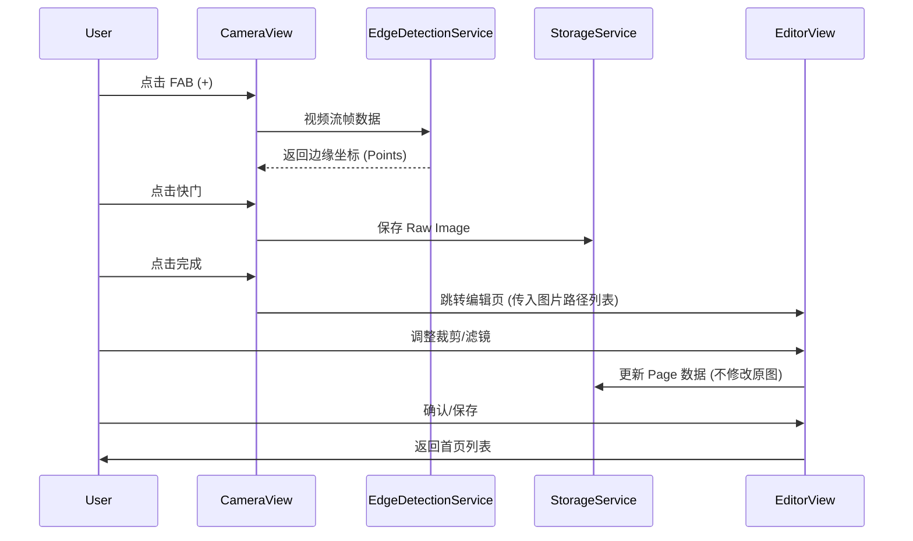

# LensCraft - Product Requirements Document (PRD)

> **Mission:** 让每一次扫描都成为数字资产的完美归档。  
> **Status:** Draft (MVP Confirmed)  
> **Design Strategy:** Classic Utility (Scheme A)  
> **Tech Stack:** Flutter (Local First)

---

## 1. 产品概述 (Overview)

**LensCraft** 是一款追求极致速度与纯净体验的跨平台文档扫描应用。它摒弃了传统扫描软件的臃肿与强制登录，采用“离线优先”策略，帮助用户快速将物理纸张转化为清晰、整洁的 PDF 文档。

### 1.1 用户画像 (Persona)
*   **目标用户：** 学生、自由职业者、商务人士。
*   **核心场景：** 课堂笔记数字化、合同/发票存档、证件备份。
*   **核心痛点：** 
    *   现有竞品广告多、启动慢。
    *   讨厌强制注册登录。
    *   OCR 准确率不稳定（MVP 阶段暂不涉及）。

---

## 2. 产品路线图 (Roadmap)

### 🚀 V1: 最小可行产品 (MVP) - "The Clean Scanner"
**目标：** 验证核心的“拍摄 -> 增强 -> 导出”流程的流畅度。

*   **智能相机 (Smart Camera):**
    *   [x] 实时相机预览。
    *   [x] 自动边缘检测 (Auto Edge Detection) 并绘制引导框。
    *   [x] 多页连续拍摄模式 (Batch Scan)。
    *   [x] 闪光灯控制 (Auto/On/Off)。
*   **文档编辑器 (Doc Editor):**
    *   [x] 透视裁剪 (Perspective Crop)：手动调整 4 个角点。
    *   [x] 魔法滤镜 (Magic Filters)：原图 (Original)、黑白文档 (B&W)、灰度 (Grayscale)。
    *   [x] 非破坏性编辑：保留原图，滤镜参数可随时回退。
*   **文档管理 (Local Vault):**
    *   [x] 首页文档列表 (按创建时间倒序)。
    *   [x] 文档详情页 (网格预览页)。
    *   [x] 重命名、删除文档。
*   **导出 (Export):**
    *   [x] 生成 PDF (标准 A4 大小)。
    *   [x] 系统原生分享 (Share Sheet)。

### 🔮 V2 (Future Releases)
*   OCR 文字提取 (离线模型)。
*   云同步与多端备份。
*   PDF 签名与水印。
*   文件夹分类管理。

---

## 3. 设计原型 (UI/UX Prototype) - Scheme A

**设计理念：** 经典效率型。首页即列表，强调快速新建。

```text
+-------------------------------------+
|  LensCraft              (Settings)  | <-- 顶栏：简单的设置入口
+-------------------------------------+
|  [🔍 Search docs...]                | <-- 搜索栏 (MVP可暂缓，V1.1加入)
+-------------------------------------+
|  Today                              | <-- 时间分组
|  [📄]  Contract_Final.pdf           |
|          3 pages • 10:30 AM         |
|                                     |
|  Yesterday                          |
|  [📄]  Math Homework                |
|          1 page • 4:00 PM           |
|                                     |
|  [📄]  Receipt_Walmart              |
|          1 page • 2:00 PM           |
|                                     |
|                                     |
|                 [ (+) ]             | <-- 悬浮巨钮 (FAB)
|                                     |     点击立即打开相机
+-------------------------------------+
```

**相机界面：**
```text
+-------------------------------------+
|  [X]                    [Flash]     |
|                                     |
|      +-----------------------+      |
|      |   /               \   |      | <-- 实时绘制的边缘检测框
|      |  |   DOCUMENT      |  |      |
|      |   \               /   |      |
|      +-----------------------+      |
|                                     |
|                                     |
| [Thumbnail]    ( O )    [Done(3)]   | <-- 左：相册/预览 
|                                     |     中：快门 
+-------------------------------------+     右：完成并去编辑(显示页数)
```

---

## 4. 业务规则与数据契约 (Business Rules)

### 4.1 核心逻辑
1.  **离线存储：** 所有数据存放在 `ApplicationDocumentsDirectory`。
2.  **非破坏性：** 
    *   `raw_image.jpg` (原始拍摄图，永远不修改)。
    *   `edit_params` (裁剪坐标、滤镜类型，存储在数据库)。
    *   预览图 = `f(raw_image, edit_params)` 实时计算生成。
3.  **PDF 生成：** 仅在用户点击“分享/导出”时，按顺序读取图片并合成 PDF。

### 4.2 数据模型 (Schema)

**Document (文档)**
| Field | Type | Description |
| :--- | :--- | :--- |
| `id` | String (UUID) | 主键 |
| `title` | String | 默认 "Scan_YYYYMMDD_HHmm" |
| `createdAt` | DateTime | 创建时间 |
| `pageCount` | Int | 页数缓存 |
| `thumbnailPath` | String | 封面缩略图路径 |

**Page (页面)**
| Field | Type | Description |
| :--- | :--- | :--- |
| `id` | String (UUID) | 主键 |
| `documentId` | String | 外键 |
| `imagePath` | String | 原始图片本地路径 |
| `cropCorners` | List<Point> | 4个归一化坐标点 (0.0-1.0) |
| `filter` | Enum | Original, BW, Grayscale |
| `order` | Int | 排序索引 |

---

## 5. 架构设计 (Architecture)

**技术栈：** Flutter
**状态管理：** Riverpod (推荐) 或 Provider
**核心库：**
*   `camera`: 拍照流控制。
*   `opencv_dart` / `flutter_image_compress`: 图像处理与压缩。
*   `isar` / `hive`: 本地数据库。
*   `pdf`: PDF 生成。

**流程图 (Processing Flow):**


